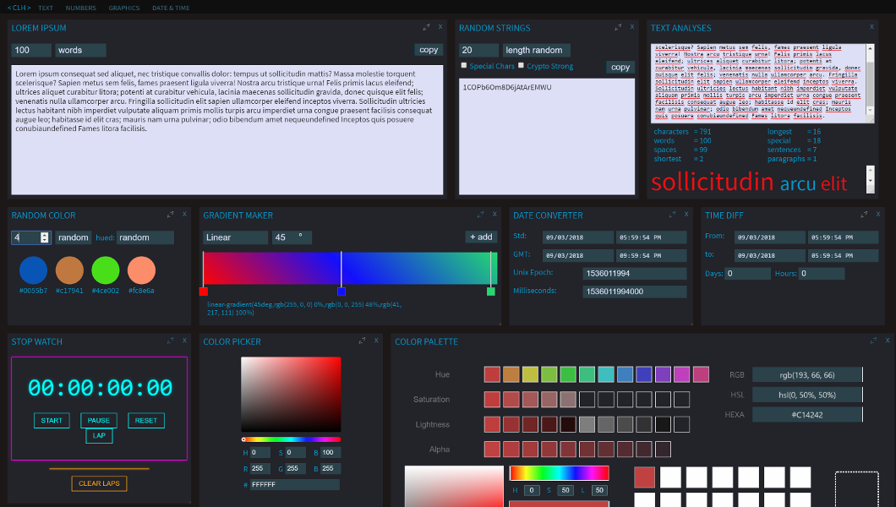

## < Coder's Little Helper >


CLH is a PWA platform for running various web components (helpers) for working on coding, designing, and testing of applications.



## Getting Started

You can immediately use the app at [coderslittlehelper.com](https://www.coderslittlehelper.com) or you can grab the code and add your own web components. Each component is a little different since each is an example of how one may use some of the new Web technologies (e.g. shadow dom, service workers). A more detailed write up is in the works.

### Prerequisites

You will need:
* Node.JS v8+
* A browser that supports Web Components (so no IE, Edge, or older browser). Firefox users must be at least version 63.0.

### Installing & Running

to test (with express):
```
npm i
```
```
npm run start
```

to build (uses builder.js):
```
npm run build
```

## Authors

* **Anthony Canterbury**

## License

This project is licensed under the MIT License - see the [LICENSE.md](LICENSE.md) file for details
